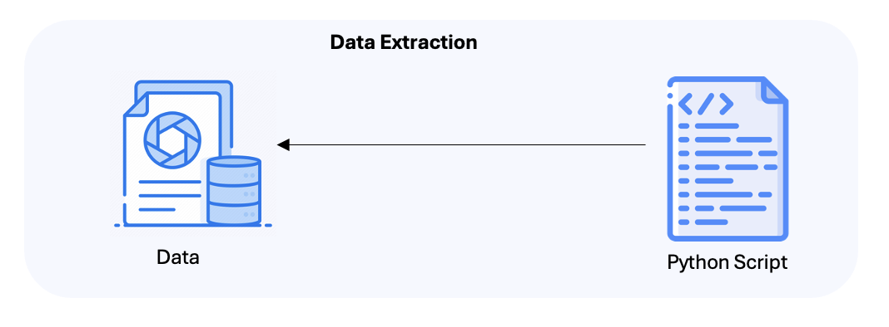

# RagHack - GenAI Fitness Advisor App

## Problem Definition:

1. **Personalized Fitness Guidance**: MyFitnessBuddy is a GenAI Fitness Advisor App that provides customized workout routines, diet plans, and a food calorie calculator, addressing the limitations of generic fitness apps.

2. **Advanced Retrieval-Augmented Generation**: It leverages a hybrid approach combining Retrieval-Augmented Generation (RAG) and Graph Retrieval-Augmented Generation (GRAG) to deliver accurate and context-aware responses to user queries.

3. **Showcasing Innovation at RAGHack**: Developed for the RAGHack hackathon, MyFitnessBuddy demonstrates the power of RAG technologies in creating engaging and effective AI-driven fitness solutions using Azure AI and popular frameworks.

## Architecture and Implementation:

### Architecture Overview:

<i>Fig.1 Architecture</i>

MyFitnessBuddy uses a hybrid architecture combining Retrieval-Augmented Generation (RAG) and Graph Retrieval-Augmented Generation (GRAG). Data is extracted using a Python script and ingested into Azure Blob Storage for structured data and Azure Cosmos DB (Gremlin API) for unstructured data. Azure AI Search indexes the structured data, while the graph database manages complex relationships in the unstructured data.
The application utilizes Azure AI Studio and Prompt Flow to define chat logic and connect data sources. User queries are processed by the app server, retrieving relevant information from Azure AI Search and Cosmos DB, which is then sent to Azure OpenAI Services (ChatGPT) to generate personalized responses.
This hybrid approach ensures accurate, context-aware, and personalized fitness guidance for users.

### Implementation Overview:

#### Data Extraction and Ingestion:

<i>Fig 2. Data Extraction Architecture</i>

<ul>
<li>The process begins with a Python script that extracts structured and unstructured data from various sources. This data is then ingested into two different storage systems:
<ul><li>Azure Blob Storage: Used for structured data, which is chunked and indexed.</li>
<li>Azure Cosmos DB (Gremlin API): Used for unstructured data, ingested as GraphDoc to enable graph-based retrieval.</li></ul>
</li>
</ul>

#### Hybrid RAG Approach:

<i>Fig 3. Hybrid RAG Architecture</i>

<ul> <li><b>RAG (Retrieval-Augmented Generation):</b>
<ul> <li>The structured data ingested into Azure Blob Storage is connected to Azure AI Search for indexing and retrieval.</li>
<li>Azure AI Studio facilitates the chunking and indexing of data, defining chat logic, and generating endpoints using Azure Prompt Flow.</li>
<li>When a user query is received, Azure AI Search retrieves relevant information from the indexed data.</li>
</ul>
</li>
</ul>

<ul><li><b>Graph RAG (Graph Retrieval-Augmented Generation):</b>
<ul><li>Azure Cosmos DB stores the unstructured data in a graph format using the Gremlin API. This approach allows the application to understand complex relationships between entities such as food items, exercises, and user health metrics.</li>
<li>The Graph RAG retrieves contextually relevant knowledge from Azure Cosmos DB, which is then combined with structured data for enhanced response generation.</li></ul>
</li></ul>

<i>Fig 4. Example of how Unstructured Data is stored as Graph in Azure CosmoDB(Gremlin API)</i>

### Prompt Flow
We deployed two endpoints using **Azure Prompt Flow**. One is a **rewrite intent** endpoint, and the other is a **My Fitness Buddy**. These endpoints are designed to solve two different use cases: one focuses on optimizing document retrieval through query generation, while the other offers personalized fitness advice within predefined safe boundaries with the knowledge base of the RAG.

#### 1. Rewrite Intent Endpoint
**Purpose**: This endpoint was designed to handle a specific task: generating search queries based on a user's question and previous conversation history. By combining the "current user question" and prior context, the endpoint generates a **single canonical query** that includes all necessary details, without variants. This is employed for document retrieval systems, where generating these precise queries and intent leading to more accurate results.

    
    
<i>Fig 5. Flow of Rewrite Intent endpoint</i>

#### 2. My Fitness Buddy endpoint
**Purpose**: The second endpoint is a **My Fitness Buddy** that offers personalized fitness advice, workout plans, and nutrition tips based on user input. The assistant is programmed to avoid medical advice and stick solely to the provided dataset to ensure that all recommendations are safe, motivational, and evidence-based and the knowledge base is retreived for the chuncks of documents configured as search indexes.

    
    
<i>Fig 6. Flow of My Fitness Buddy endpoint </i>

### Application Flow:
- The user interacts with the MyFitnessBuddy app through a Python Streamlit-based chatbot interface.
- The application server processes the user's query and directs it to the appropriate retrieval system (Azure AI Search for structured data or Azure Cosmos DB for unstructured data) based on the query type.
- Relevant information is retrieved from the selected data source and sent to Azure OpenAI Services (ChatGPT) along with a crafted prompt to generate a personalized response.
- The final response, enriched with contextually relevant information, is returned to the user via the Streamlit app, providing tailored fitness advice and recommendations.

<i>Fig 7. Application</i>

## Technologies Used:
- **Data Storage and Retrieval:** Azure Blob Storage, Azure Cosmos DB (Gremlin API), Azure AI Search.
- **AI and Language Models:** Azure OpenAI Services (ChatGPT).
- **Data Processing and Logic Flow:** Azure AI Studio, Azure Prompt Flow.
- **Backend and Application Server:** Python for data extraction and preprocessing, with multiple integration points for data ingestion and retrieval.

